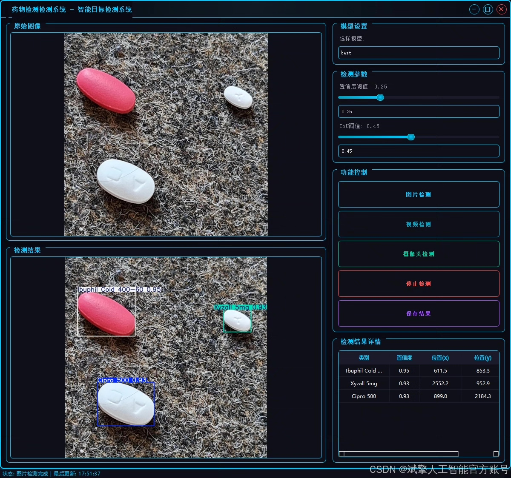
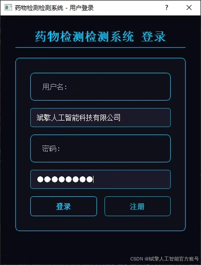
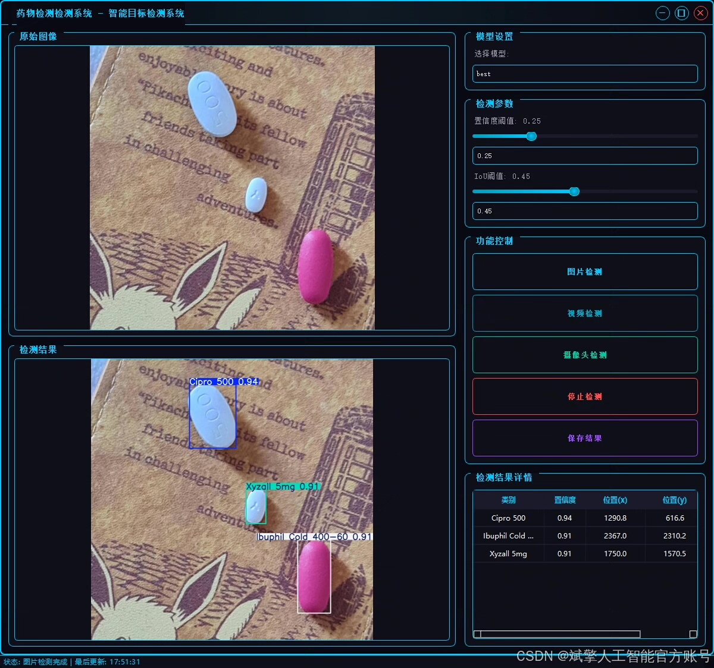
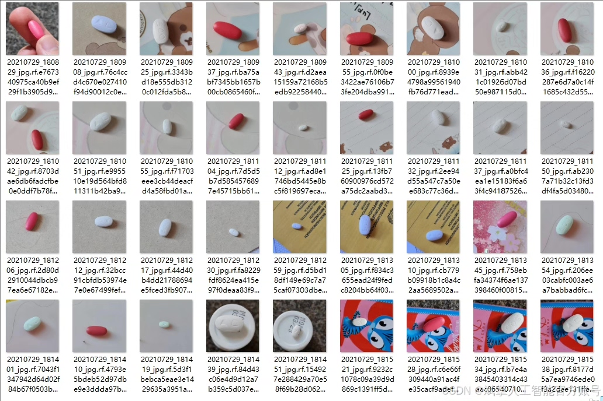
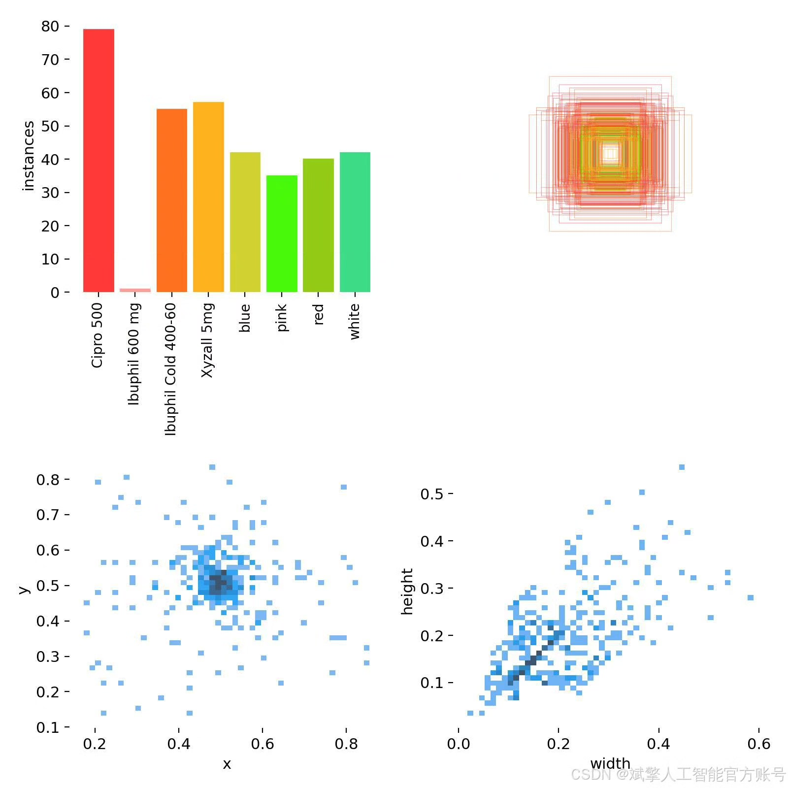
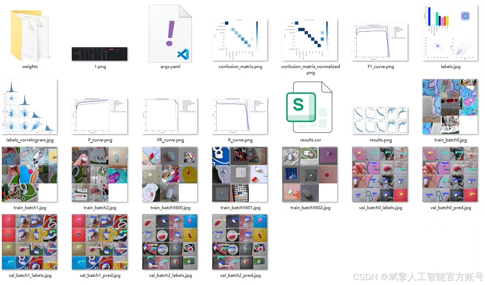
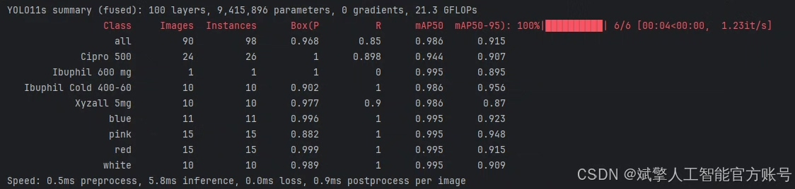
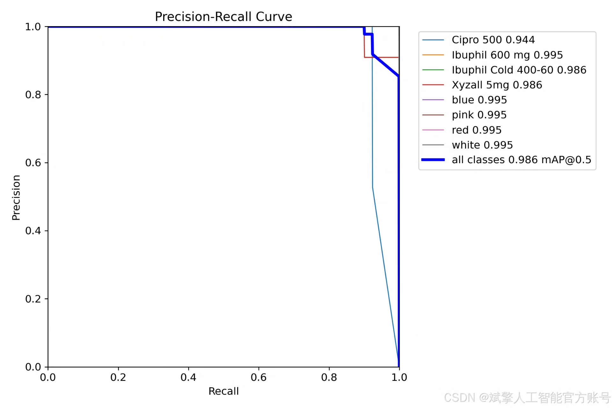
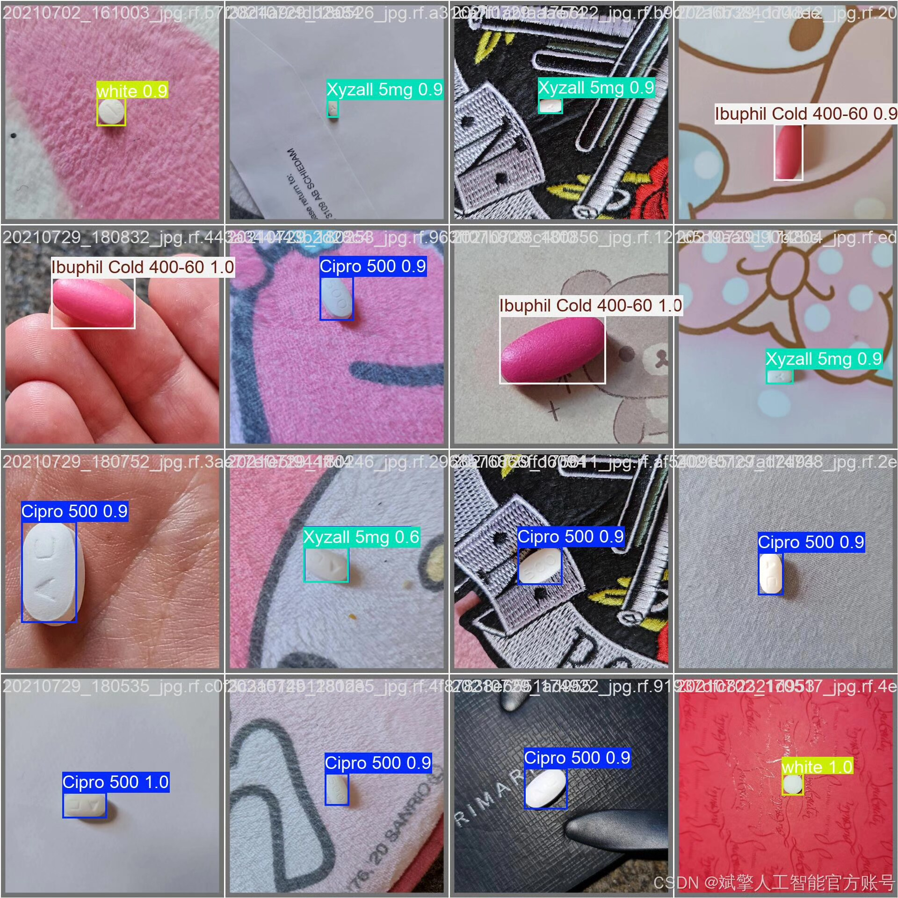

# YOLOv11 Drug Recognition System

## Body

YOLOv11 Drug Recognition System Based on Deep Learning YOLOv11 Drug Recognition Detection System (YOLOv11+YOLO dataset + UI interface + login registration interface + Python project source code + model)

Drug recognition is of great significance in healthcare and pharmaceutical management, but traditional methods are inefficient and prone to errors. This paper proposes a drug recognition detection system based on deep learning YOLOv11, which can efficiently and accurately recognize 8 common drugs (including Cipro 500, Ibuprofen 600 mg, etc.) and color features (red, blue, pink, white). The system combines the high-performance detection capabilities of the YOLOv11 algorithm and integrates a user-friendly UI interface with login registration functions. Experiments show that this system performs excellently on custom YOLO datasets, with an average precision (mAP) above 98.6%, significantly improving the level of automation in drug recognition. The Python source code and pre-trained models of this project can provide references for medical intelligence applications.

✅ User Login and Registration: Supports password verification and security validation.
✅ Three detection modes: Based on the YOLOv11 model, supports image, video, and real-time camera detection, accurately recognizing targets.
✅ Dual-screen comparison: Displays the original scene and detection results on the same screen.
✅ Data visualization: Real-time table displaying the category, confidence, and coordinates of detected targets.
✅ Intelligent parameter adjustment: Offers a confidence slide bar to dynamically optimize detection accuracy, adapting to different scene needs.
✅ Sci-fi style interactive interface: Dark theme combined with dynamic light effects, reducing visual fatigue and enhancing operational experience.

## Images

## Payment

Here is a pay link on Stripe ( https://buy.stripe.com/3cs8yP7sY87d0vu9AB ). Please contact me lonlonago@foxmail.com after funding $89, and I will send you a complete data files , thank you!

